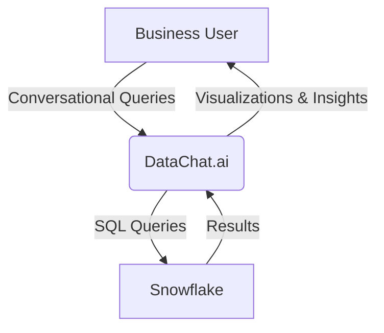
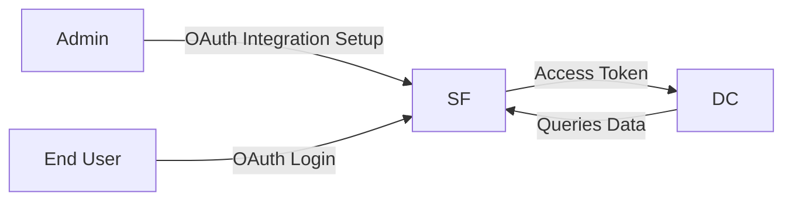

## Executive Summary

**DataChat.ai** is an AI-driven analytics platform that empowers business users to rapidly analyze advertising spend data across multiple platforms through a conversational interface. Its primary value proposition is enabling quick, intuitive, and self-service insights without technical barriers, significantly accelerating marketing decisions related to ad performance and optimization.

### Core Functionalities & Unique Selling Points:

- **No-code Conversational Analytics:** Natural language querying that automatically translates to SQL.
- **Instant Visualizations:** Auto-generated charts and dashboards for quick insights.
- **AI-driven Insights:** Integrated forecasting and anomaly detection.
- **Transparent & Traceable Analysis:** Step-by-step documentation of queries and transformations.

### Target Users & Use Cases:

- **Marketing Analysts and Decision-makers**
- **Media Buyers**
- Typical use cases include:
  - Cross-platform spend analysis
  - ROI optimization
  - Budget allocation decisions
  - Campaign performance tracking

## Technical Architecture Overview

DataChat integrates tightly with Snowflake, leveraging Snowflake's powerful data processing capabilities and robust security.

### Integration with Snowflake

- Direct JDBC/ODBC connections or OAuth-based authentication.
- Available as a **Snowflake Native App** via the Snowflake Marketplace, simplifying setup and enhancing security.

### Data Security Practices

- End-to-end encryption (AES-256 at rest, TLS in transit).
- OAuth integration to ensure Snowflake role-based access control.
- DataChat does not persist raw data; sensitive information remains within Snowflake.

### Computational Workload Distribution

- Snowflake handles heavy computations (joins, aggregations).
- DataChat manages query orchestration, conversational AI, and visualization rendering.
- ML computations can leverage Snowflake Snowpark or DataChat’s processing, depending on deployment.

### Setup and Configuration Process

1. **Direct Connection:** Provide Snowflake credentials within DataChat.
2. **OAuth Connection:** Configure OAuth security integration in Snowflake and authenticate users via Snowflake’s SSO.
3. **Native App Installation:** Install directly from Snowflake Marketplace with minimal configuration.

### User Workflow

- User poses conversational questions to DataChat.
- AI translates queries into SQL for execution in Snowflake.
- Snowflake returns results; DataChat presents visualizations.
- Users iteratively refine analyses, creating interactive dashboards (Insight Boards).

### Leveraging AI Securely

- DataChat uses GPT-4 (Azure OpenAI) to translate user intent into queries.
- Sensitive business data never leaves Snowflake; only metadata/schema info is used by AI.

### Potential Red Flags

- **Data Preparation:** Requires clean, unified data in Snowflake.
- **AI Interpretation:** Users must frame clear, specific questions to avoid misinterpretation.
- **Cost Management:** High computational queries can quickly increase Snowflake usage costs.
- **Governance:** Requires robust data access management within Snowflake.

Overall, DataChat.ai’s integration with Snowflake offers powerful capabilities for advertising analytics, provided there’s attention to data governance, cost management, and user training.

